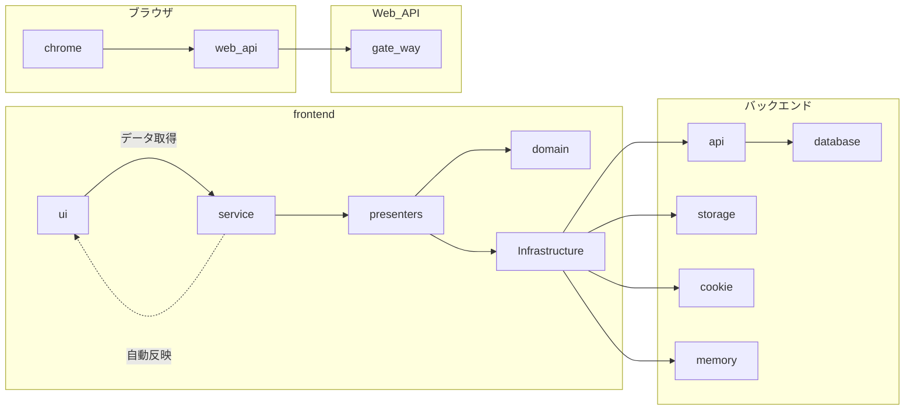

# gRPC + マイクロサービスのサンプルプロジェクト

お店を探すサービスを例にしてアプリを作ってみる。

## 導入メモ

```shell
git clone git@github.com:makoto-developer/grpc_microservices_sample.git
cd grpc_microservices_sample
asdf install 

```

## 構成



## 技術

# 使い方

Protoから各言語のコードを生成する

```shell
cd protobuf

# makeコマンドを実行する前にMakefileを参照して何やっているか理解してから実行すること
# `microservices`と`frontend`の`proto/`ディレクトリを削除してクリーンな状態にしてから生成しています。
make protogen
```

frontendを起動

```shell
cd frontend
yarn install
yarn dev
```

backendを起動

```shell
go run ./main.go
```
