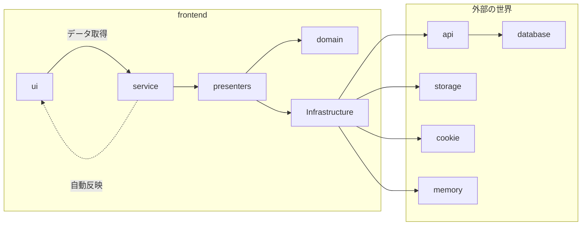

# Frontend

## アーキテクチャ

カスタマイズしたレイヤードアーキテクチャで設計する。
フロントエンドのコードの可読性・保守性を上げるには**関心事の分離**が重要だと考えている。
よくあるReactのコードはAPIの取得、データ加工、表示のロジックをごちゃまぜにして理解するのに時間がかかる。
UI層 -> Service層 -> Model層 -> Datasouceと一方通行のルールをもたせることでコードを理解しやすくしたい。

**レイヤー**

| レイヤー             | 役割               | ディレクトリ              |ノート|
|:-----------------|:-----------------|:--------------------|:----|
| ui               | 画面表示             |||
| service          | ロジック             || uiとserviceは1:1で存在する |
| presenters       | ロジック層とInfra層の橋渡し |||
| domain           ||||
| Infra(stracture) | 永続化              | src/infra           |  必要に応じてここでデータをパースしたりする |

**概念図**



## Requirement

- Node.js v16
- Yarn v3

## 準備

```shell
yarn install
```

## 起動

```shell
yarn dev
```

**Lint**

```shell
yarn lint
```

**Lint fix**
```shell
yarn lint:fix
```
